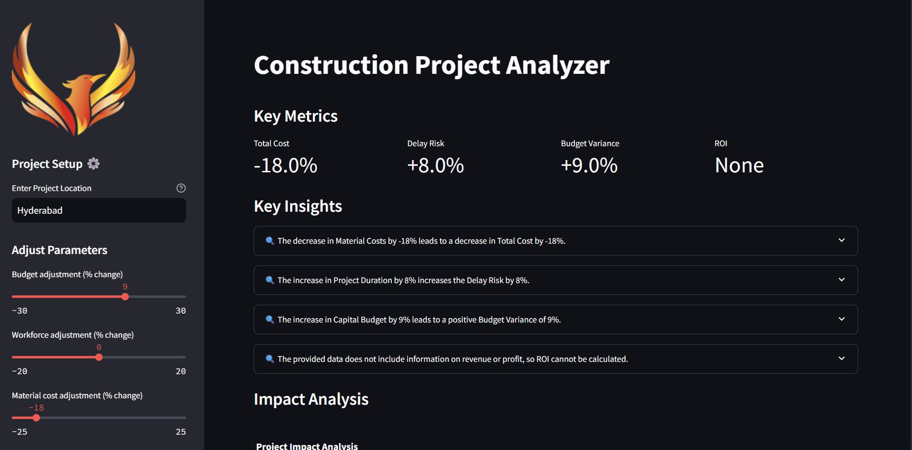

# Construction AI Analyst 🏗️

[](https://constructionaianalyst.streamlit.app/)
[](https://streamlit.io/)
[](https://ai.google.dev/)
[](https://opensource.org/licenses/MIT)

An AI-powered analytics tool for construction project risk assessment and impact analysis.

 <!-- Add actual screenshot later -->


## Features ✨

- **Real-Time Risk Modeling**  
  Predict cost overruns, delays, and ROI impacts using 5+ dynamic parameters

- **Interactive Visualizations**  
  Professional-grade charts for data-driven decision making:
  - Impact Analysis Bar Charts
  - Risk Distribution Gauge Charts

- **Customizable Inputs**  
  - Core parameters with slider controls
  - Free-form custom parameters
  - Location-based context analysis

- **AI-Powered Insights**  
  - Causal relationship detection
  - Actionable recommendations
  - Methodology explanations

## Installation 🛠️

### Prerequisites
- Python 3.8+
- [Gemini API Key](https://ai.google.dev/)

### Quick Start
```bash
# Clone repository
git clone https://github.com/yourusername/construction-ai-analyst.git
cd construction-ai-analyst

# Install dependencies
pip install -r requirements.txt

# Set up API key
echo "API_KEY=your_gemini_api_key_here" > .env

# Launch application
streamlit run app.py
```

## Usage 📈

### Input Parameters
| Parameter | Range | Default | Description |
|-----------|-------|---------|-------------|
| Capital Budget | ±30% | 0% | Budget adjustment |
| Labor Availability | ±20% | 0% | Workforce changes |
| Material Costs | ±25% | 0% | Material price fluctuations |
| Project Duration | ±15% | 0% | Timeline modifications |
| Weather Impact | 0-40% | 0% | Adverse weather likelihood |

**Custom Parameters**:  
Add project-specific factors using `Parameter: Value` format:
```
Soil Quality: Poor
Regulatory Hurdles: High
```

### Output Interpretation
1. **Key Metrics Dashboard**  
   - Total Cost Change
   - Delay Risk Probability
   - Budget Variance
   - ROI Impact

2. **Interactive Visualizations**  
   - Hover-enabled charts
   - Proportional risk analysis
   - Export-ready formats

3. **Detailed Insights**  
   - Expandable analysis sections
   - Location-specific recommendations
   - Methodology explanations

## Tech Stack 💻

| Component | Technology |
|-----------|------------|
| Frontend | Streamlit |
| AI Engine | Google Gemini |
| Visualization | Plotly |
| Data Processing | Pandas |
| Configuration | Python-dotenv |

## Directory Structure 📂
```
.
├── app.py                 # Main application logic
├── model_loader.py        # Gemini API handler
├── utils.py               # Data processing & visualization
├── constants.py           # Configurations & parameters
├── assets/                # Static resources
│   └── logo.png           # Application logo
├── requirements.txt       # Dependency list
└── .env                   # API credentials (gitignored)
```

## Contributing 🤝
We welcome contributions! Please follow these guidelines:
1. Fork the repository
2. Create your feature branch (`git checkout -b feature/amazing-feature`)
3. Commit changes (`git commit -m 'Add some amazing feature'`)
4. Push to branch (`git push origin feature/amazing-feature`)
5. Open a Pull Request

**Coding Standards**:
- PEP8 compliance
- Type hints for all functions
- Comprehensive docstrings
- 80%+ test coverage

## License 📄
This project is licensed under the MIT License - see [LICENSE](LICENSE) file for details.

---

**Disclaimer**: This application provides predictive analytics based on AI models. Actual project outcomes may vary based on real-world conditions.
